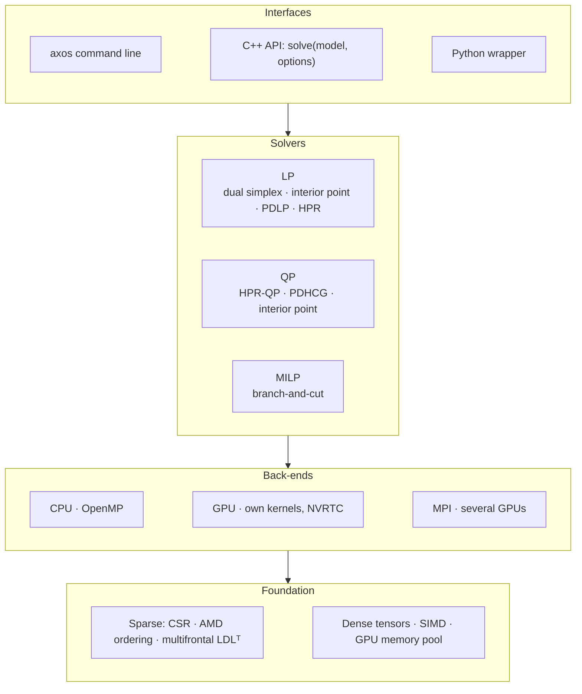

# AXOS

**A sovereign, GPU-accelerated optimization solver core for Linear (LP),
Quadratic (QP) and Mixed-Integer Linear (MILP) programs, built from
scratch in C++17.**

AXOS reads standard MPS / QPS models and solves them on multi-core CPUs
(OpenMP), on NVIDIA GPUs, and across several GPUs with MPI.
- **No solver library underneath.** No existing optimization solver
  library is used. Presolve, scaling, sparse linear algebra, the simplex,
  interior-point and first-order methods, and branch-and-cut are our own
  code, written from the mathematics.
- **No CUDA toolkit needed.** The GPU kernels of the QP, MILP and HPR
  solvers are our own and are compiled at run time with NVRTC.
- **Ways to use it.** A command-line tool, a header-only C++ API and a
  Python wrapper.

Built by Team Solvix26 for Smart India Hackathon 2026, problem statement
**SIH26119** (Mangalore Refinery and Petrochemicals Ltd): *Indigenous
GPU-Accelerated Optimization Solver (Sovereign Alternative to Xpress /
CPLEX)*.

---

## Highlights

| | Result |
|---|---|
| **QP**, 138 Maros–Meszaros problems (1e-6) | AXOS auto solves **129**, second only to PIQP (136), ahead of SCS, Clarabel, OSQP and HiGHS. |
| **QP**, AXOS HPR-QP on the GPU | **7.8× faster** than HPR-QP.jl, the method authors' own GPU code (113 problems both solve). |
| **QP**, 14 problems with 1–4 M non-zeros | **13 solved** on the GPU in 5.7 s (shifted geometric mean), **17–18× faster** than Clarabel and PIQP. |
| **LP**, large generated models | GPU PDLP **2–5.9× faster** than HiGHS on the CPU. It solves a 2 M-non-zero LP in 4.8 s that HiGHS could not finish in 60 s. |
| **LP**, against the GPU solver inside HiGHS (cuPDLP-C) | **1.6–3.8× faster** on all 6 test LPs. |
| **MILP**, 16 larger MIPLIB 2017 models | Verified solutions on **12**, against SCIP 11 and CBC 9, with a lower mean primal gap than both. |
| **Several GPUs** | MPI splits the constraint matrix across GPUs. 2 and 4 ranks give the same answers as one GPU. |
| **Trust** | Every answer is re-checked on the original model. No AXOS answer was wrong in any benchmark. |

On the 50 smaller MIPLIB instances the established solvers still prove more
optima (SCIP 16, HiGHS 15, CBC 7, AXOS 3); see the [roadmap](#roadmap).

---

## What AXOS solves

| Class | Methods | Device |
|---|---|---|
| **LP** | Bounded dual simplex: exact vertices, warm starts. | CPU |
| | Mehrotra interior point: high accuracy, on our multifrontal LDLᵀ. | CPU, GPU |
| | Restarted Halpern PDHG (PDLP): first order, very large models. | CPU, GPU |
| | HPR (Halpern Peaceman–Rachford). | GPU, CPU, multi-GPU |
| | `auto` chains them. | |
| **QP** (convex) | HPR-QP: matrix-free, fused GPU kernels, CUDA graphs. | GPU, CPU, multi-GPU |
| | PDHCG: primal-dual hybrid conjugate gradient. | GPU, CPU |
| | Interior point: high accuracy. | CPU |
| | `auto` picks the method and the device. | |
| **MILP** | Branch-and-cut. The search tree runs on the CPU; probing, propagation, feasibility-jump walkers and batched LP bounds run on the GPU. | CPU + GPU |



---

## Quick start

### Windows: Git Bash, MSVC 2019+ Build Tools, Python 3

No CUDA toolkit is needed. Three pip wheels provide the CUDA runtime, the
headers and NVRTC:

```bash
python -m venv .venv
.venv/Scripts/python -m pip install nvidia-cuda-runtime-cu12 nvidia-cuda-nvcc-cu12 nvidia-cuda-nvrtc-cu12
bash apps/build.sh                    # build/axos.exe with GPU support
bash apps/build.sh cpu axos_cpu       # build/axos_cpu.exe, CPU only
```

`apps/build.sh` finds `vcvars64.bat` in the default Visual Studio 2019
Build Tools location; set `VCVARS` if yours is elsewhere. The GPU build
needs an NVIDIA driver.

### Linux: g++ with OpenMP, CUDA headers in `CUDA_HOME`

```bash
make axos                             # build/axos with GPU support
bash apps/build.sh cpu axos_cpu       # CPU only
```

### Solve something

```bash
build/axos model.mps                                   # LP, QP or MILP, from the file
build/axos model.qps --method hprqp --device gpu       # QP on the GPU
build/axos model.mps --time-limit 60 --gap 1e-4        # MILP with limits
build/axos model.mps --type lp                         # LP relaxation of a MILP
build/axos model.mps --solution x.sol --json result.json
```

The GPU kernels are compiled from the source tree on first use. If you
move the executable, set `AXOS_SRC_DIR` to the `src` directory.

---

## Using AXOS

### Command line

| Option | Meaning |
|---|---|
| `--type auto\|lp\|qp\|milp` | Problem type. Default: from the file (integer markers mean MILP, a quadratic section means QP). |
| `--method NAME` | LP: `auto simplex ipm pdlp hpr`. QP: `auto hprqp pdhcg ipm`. MILP: `auto`. |
| `--device auto\|cpu\|gpu` | Default `auto`: the GPU where it pays off. |
| `--time-limit S` | Seconds (default 3600). |
| `--tol T` | LP / QP relative KKT tolerance (default 1e-6). |
| `--gap G` | MILP relative gap (default 1e-4). |
| `--no-presolve`, `--no-cuts`, `--no-heuristics` | MILP switches. |
| `--solution FILE` | Write the solution as `name value` lines. |
| `--json FILE\|-` | Write the result as JSON (`-` for standard output). |
| `--quiet`, `--verbose N`, `--info`, `--version` | |

The exit status is:
- 0: optimal;
- 1: a solution without proof of optimality;
- 2: infeasible;
- 3: unbounded;
- 4: no solution within the limits;
- 5: error;
- 64: bad usage.

Every reported solution is checked against the model. The summary and the
JSON give its largest relative violation.

### C++ (header only)

```cpp
#include "solver/api.h"
using namespace AXOS::Solver;

Model m = read_model("model.mps");
Options o;
o.time_limit = 60;                 // also: type, method, device, tol, gap, verbose
Result r = solve(m, o);            // r.status, r.objective, r.bound, r.x, r.y, r.gap()
std::cout << result_json(m, r);    // or write_solution(std::cout, m, r)
```

### Python

The wrapper is `apps/axos.py`; put `apps/` on `PYTHONPATH`. It runs the
executable and parses its JSON.

```python
import axos
r = axos.solve("model.mps", time_limit=60, device="gpu")
print(r["status"], r["objective"], r["x"])
r = axos.solve("big.qps", ranks=4, device="gpu")      # several GPUs through MPI
```

### Several GPUs (MPI)

Build `build/axos_mpi` with `bash apps/build.sh mpi axos_mpi`. On Windows
this needs the MS-MPI runtime and SDK; on Linux, `mpicxx` (`make axos_mpi`).
Then start it under `mpiexec`:

```bash
mpiexec -n 4 build/axos_mpi big.qps --device gpu
```

How the work is split:
- The constraint rows are divided into K blocks with equal non-zeros, so
  each GPU holds 1/K of A.
- Products with A need no communication. One `MPI_Allreduce` of n numbers
  per iteration sums the partial products with Aᵀ.
- Rank 0 makes the stop and restart decisions, so every rank returns the
  same solution.
- Rank r uses GPU r mod (GPUs per machine).
- LPs and QPs run distributed. A MILP needs a single process.

---

## How it works

**LP**
- Presolve (empty, fixed, singleton and duplicate rows and columns) with a
  postsolve that restores primal and dual values. Ruiz and Pock–Chambolle
  scaling.
- The dual simplex:
  - Hypersparse LU with product-form updates.
  - Dual steepest-edge pricing and bound flipping.
  - A Harris-style ratio test with cycle detection and perturbation.
  - Warm starts.
- The interior point (Mehrotra predictor-corrector) solves its KKT systems
  with our supernodal multifrontal LDLᵀ and iterative refinement. Optional
  crossover.
- PDLP: restarted, reflected Halpern PDHG with infeasibility detection.

**QP**
- HPR-QP (Chen, Sun, Yuan, Zhang & Zhao, 2025):
  - Q and A are only applied as sparse products.
  - Every vector update is fused into the product that feeds it, so one
    iteration is four GPU kernels.
  - Blocks of iterations replay as CUDA graphs.
  - Restarts and penalty updates follow the method's merit function.
- PDHCG with inexact conjugate-gradient steps.
- A QP interior point for small, ill-conditioned problems.
- `auto` uses the interior point when one factorization is cheap,
  otherwise HPR-QP, on the GPU for large problems.

**MILP:** branch-and-cut with the tree on the CPU.
- Presolve with coefficient tightening, and domain propagation.
- Double probing on the GPU: 256 probes at once, re-propagating only the
  changed constraints.
- Dual simplex at the root and at the nodes. A GPU HPR solve seeds the
  heuristics on large models.
- Gomory mixed-integer cuts from the tableau, and c-MIR cuts with
  variable-bound substitution and aggregation.
- Reduced-cost fixing.
- Primal heuristics:
  - Feasibility jump on the CPU racing 64 GPU walkers.
  - Rounding, fix-and-propagate and diving.
  - The objective feasibility pump.
  - RENS and RINS.
- Tree search:
  - Reliability pseudocost branching with strong branching.
  - Batched GPU PDHG gives valid bounds for strong-branching children.
  - Best-bound node selection with plunging.
- Every incumbent is verified on the original model.

**GPU code:** the QP, MILP and HPR kernels are our own CUDA C++.
- Compiled once per process by NVRTC for the installed GPU.
- Launched through the CUDA driver API.
- Vector updates fused into the sparse products.

The plan for MIQP, NLP and MINLP is in
[src/solver/ROADMAP.md](src/solver/ROADMAP.md).

---

## Benchmarks

Each solver reads the same file, runs with the same limits, and has its
answer re-scored with one common metric.

Hardware:
- QP and MILP: a laptop with a Core i7-12650H and an RTX 3050 (4 GB).
- LP: a laptop with a Ryzen 7 7845HS and an RTX 4060.

**QP** ([full report](benchmarks/qp/README.md)). Maros–Meszaros is 138 problems (1e-6, 60 s each); "large" is 14 problems with 1–4 M non-zeros (120 s each).

| Solver | Maros–Meszaros: solved | Large: solved | Large: time (SGM, s) |
|---|---|---|---|
| PIQP | 136 | 9 | 46.8 |
| **AXOS auto** | **129** | **13** | 17.2 |
| SCS | 125 | 9 | 31.9 |
| **AXOS HPR-QP (GPU)** | **123** | **13** | **5.7** |
| Clarabel | 119 | 9 | 44.0 |
| HPR-QP.jl (GPU) | 114 | 11 | 12.6 |
| OSQP | 95 | 9 | 44.7 |
| HiGHS | 79 | – | – |
| PDHCG.jl (GPU) | 75 | 7 | 52.3 |

**LP** ([full results](benchmarks/solver/RESULTS.md)), tolerance 1e-6:

| Model | AXOS PDLP (GPU) | HiGHS (CPU) |
|---|---|---|
| packing200k (2 M non-zeros) | 4.8 s | no answer within its 60 s limit |
| mcf50k | 0.84 s | 4.98 s |
| transport700 | 0.93 s | 1.87 s |

- Against HiGHS 1.15 built with its own GPU solver (cuPDLP-C), AXOS PDLP is 1.6–3.8× faster on all 6 test LPs.
- On Netlib (25 models, 6 of them infeasible), `auto` answers 21 correctly.
- The interior point reaches about 1e-9 relative objective error.

**MILP** ([full report](benchmarks/milp/README.md)). MIPLIB 2017, 60 s, one CPU thread per solver, relative gap 1e-4.

| Solver | 50 instances: solved | 50: with a solution | 50: mean primal gap | 16 larger: solved | 16: with a solution | 16: mean primal gap |
|---|---|---|---|---|---|---|
| HiGHS 1.15 | 15 | 47 | 0.089 | 4 | 15 | 0.327 |
| SCIP 10 | 16 | 46 | 0.135 | 3 | 11 | 0.520 |
| CBC 2.10 | 7 | 46 | 0.112 | 3 | 9 | 0.506 |
| **AXOS (CPU + GPU)** | 3 | 44 | 0.196 | 0 | **12** | **0.468** |
| AXOS (CPU only) | 3 | 44 | 0.209 | 0 | 9 | 0.573 |

GPU components against their CPU counterparts:
- Double probing: median 2.2× faster, up to 5.8×.
- LP relaxation against our dual simplex: median 1.6× faster, up to 99×.
- rail01's LP is solved only on the GPU.

**Multi-GPU (MPI)** ([details](benchmarks/qp/README.md#several-gpus-hpr-qp-over-mpi)), with 2 and 4 ranks:
- All 13 solved large QPs take the same iterations and reach the same objective as on one GPU.
- On Maros–Meszaros, 103 of 114 take identical iteration counts. The rest differ only by rounding.
- The test laptop has one GPU, so these runs check correctness, not speed.

---

## Repository layout

```
apps/              axos (command line), axos.py (Python wrapper), build.sh
src/solver/        model, MPS / QPS I/O, presolve, scaling; api.h (LP / QP / MILP entry point)
src/solver/lp/     dual simplex, basis LU, interior point, PDLP (CPU and CUDA)
src/solver/qp/     HPR-QP, PDHCG, QP interior point, GPU kernels (NVRTC), MPI (qp_dist.h)
src/solver/milp/   branch-and-cut, cuts, propagation, probing, heuristics, GPU kernels
src/sparse/        CSR kernels, AMD ordering, multifrontal LDLᵀ
src/               dense tensors (tensorET.h), SIMD kernels, GPU memory pool
benchmarks/        qp/, milp/, solver/ (LP), sparse/, dense/: drivers, scripts, results
tests/             CLI and API regression tests, test models
docs/              TENSOR_SPEC.md (dense layer specification)
```

## Testing

```bash
python tests/test_cli.py       # 15 checks: LP, QP and MILP answers, exit codes, files, MPI if built
make test_solver_cpu           # Linux: solver unit tests, CPU only
make test_solver               # Linux: with CUDA (nvcc, cuSPARSE, cuDSS)
```

Benchmark drivers and reproduction steps are in each `benchmarks/*/README.md`.

---

## Roadmap

1. **Industrial strength.**
   - MILP: conflict analysis, symmetry handling, and clique, knapsack-cover
     and zero-half cuts.
   - Restarts and Forrest–Tomlin basis updates.
   - Infeasibility certificates through a homogeneous self-dual interior
     point.
   - Degenerate-LP fixes.
   - Pilot refinery planning, crude blending and scheduling models.
2. **Scale and modelling.**
   - Millions of variables: Mittelmann's large LPs and the full MIPLIB 2017
     benchmark set.
   - SOS1 / SOS2, semi-continuous, indicator and quadratic constraints.
   - Parallel tree search, concurrent LP solves and a stronger presolve.
3. **New problem classes.**
   - MIQP: the QP solver at the branch-and-bound nodes.
   - An NLP interior point.
   - Convex MINLP by outer approximation.
   - 2-D multi-GPU partitioning.

## References

1. D. Applegate et al., *Practical Large-Scale Linear Programming using Primal-Dual Hybrid Gradient* (PDLP), NeurIPS 2021.
2. H. Lu, J. Yang, *cuPDLP.jl: a GPU implementation of restarted PDHG for linear programming*, 2023.
3. K. Chen, D. Sun, Y. Yuan, G. Zhang, X. Zhao, *HPR-QP: a dual Halpern Peaceman–Rachford method for large-scale convex composite QP*, arXiv:2507.02470, 2025.
4. Y. Huang et al., *A Restarted Primal-Dual Hybrid Conjugate Gradient Method for Large-Scale Quadratic Programming*, INFORMS J. Computing, 2025.
5. S. Mehrotra, *On the implementation of a primal-dual interior point method*, SIAM J. Optimization, 1992.
6. B. Luteberget, G. Sartor, *Feasibility Jump: an LP-free Lagrangian MIP heuristic*, Math. Programming Computation, 2023.
7. T. Achterberg, T. Koch, A. Martin, *Branching rules revisited*, Operations Research Letters, 2005.
8. H. Marchand, L. Wolsey, *Aggregation and mixed integer rounding to solve MIPs*, Operations Research, 2001.
9. M. Fischetti, F. Glover, A. Lodi, *The feasibility pump*, Mathematical Programming, 2005.
10. A. Gleixner et al., *MIPLIB 2017: data-driven compilation of the 6th mixed-integer programming library*, Math. Programming Computation, 2021.
11. I. Maros, C. Mészáros, *A repository of convex quadratic programming problems*, Optimization Methods and Software, 1999.
12. Netlib LP test set; H. Mittelmann, *Benchmarks for Optimization Software*.
